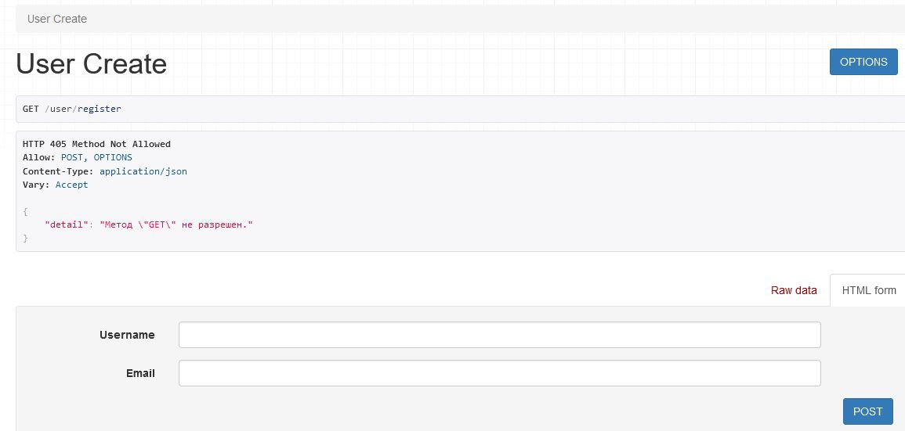

# Тестовое задание для likesoft
Приложение для управления книгами в библиотеке. Реалиховано REST API для управления книгами. 

/api/books/

Эндпоинт для регистрации пользователя, при которой происходит отрпавка приветственного письма на указанный e-mail через celery + redis.

/user/register/

Сборка в docker/docker-compose через поднятие и конфигурирование nginx.
### клонируем репозиторий 

    git clone https://github.com/se-andrey/baum.git

### запуск

Создайте файл .env и заполните его в соответствии с .env.example.

Если на сервере нет docker/docker-compose, то установите его - инструкция https://docs.docker.com/

Для запуска:

    docker-compose up --build 

Для остановки:

    docker-compose down -v
